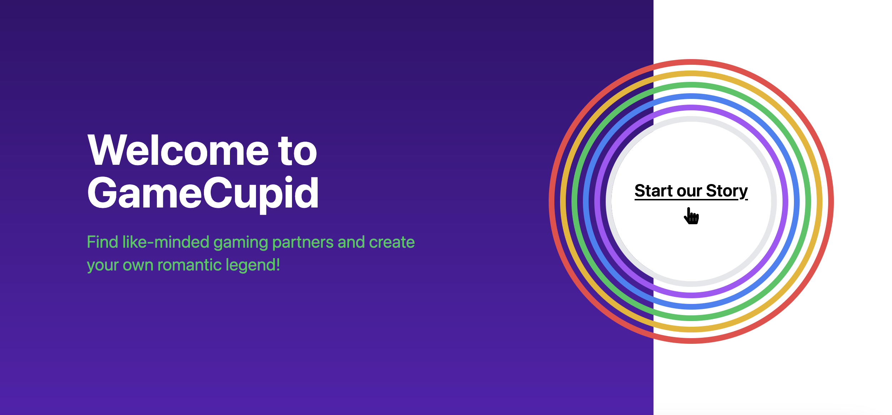
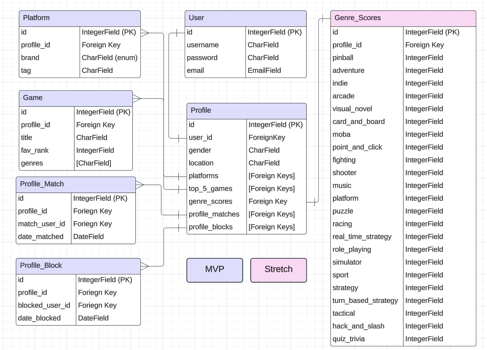

# GameCupid

**Use your love of video games as a way to meet new people.**

Current backend for the GameCupid app. Currently can create user, edit profile data, add games and platform favorites, and match to other users based on shared liked genres. Further features will include a more robust matching algorithm, being able to like and block users, and to send direct messages to the users you match with.

Deployed App: [GameCupid Netlify App](https://gamecupid.netlify.app/)

Github Repo: [GameCupid Frontend Repo](https://github.com/BellaCheng28/game-cupid-front-end)

## Tech Used

This backend was built using django rest framework, simplejwt, heroku, psycopg2-binary, whitenoise, and gunicorn.

## Database Configuration (ERD)

## Routing Table

| Name             | Route                   | Use                     | Method       |
|------------------|-------------------------|-------------------------|--------------|
| Create User      | users/register          | create a user           | POST         |
| Login User       | users/login             | log in user             | POST         |
| Verify User      | users/token/refresh     | verify user             | GET          |
| Delete User      | users/:user_id          | delete user             | DELETE       |
| View Profile     | profile/                | view own profile        | GET          |
| View Other Profile| profile/:profile_id/   | view other profile      | GET          |
| Edit Profile     | profile/:profile_id/edit/| edit profile           | PUT          |
| View Profile Games| profile/games          | view profile games      | GET          |
| Edit Profile Games| profile/games/:pk/edit | edit favorite games     | PUT/DELETE   |
| Platform Choice View| profile/platforms/choices/| view platform choices| GET        |
| Platform Create   | profile/platforms/:profile_id| add profile platform | POST      |
| Edit Profile Platforms| profile/platform/:platform_id/edit | edit platforms | PUT/DELETE |
| Search for Matches | profile/match/search/ | run match algorithm     | GET          |
| View Matches     | profile/match/:match_id | view matched profiles   | GET          |
| Like Profile     | profile/match/add       | like profile            | POST         |
| Create Block     | matches/block/add       | block profile           | POST         |
| Get Blocks       |profile/block/:block_id  | get block detail/delete | GET/DELETE   |